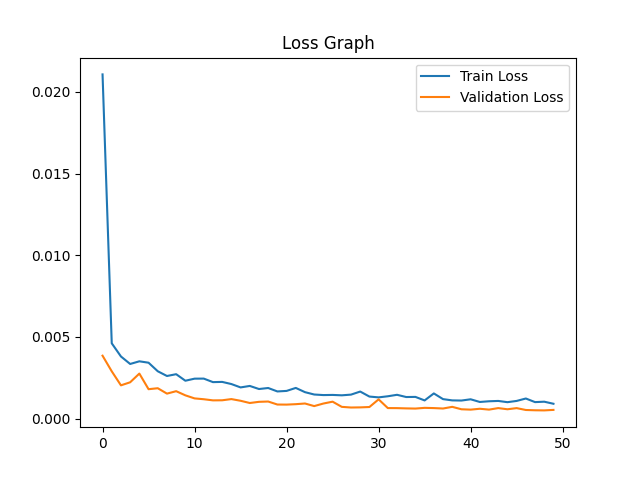
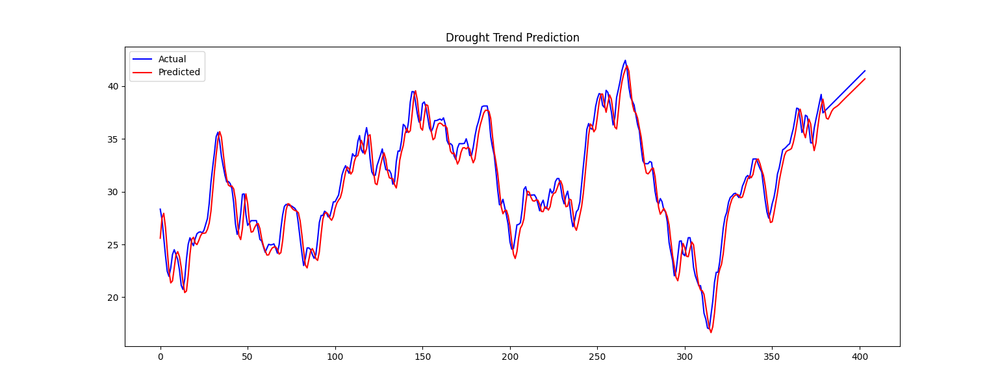

# 🌦️ Drought Trend Prediction using LSTM

<p align="center">


</p>

---

# 📖 Overview

Drought prediction plays a vital role in agriculture, climate monitoring, and water resource management. Accurate forecasting helps governments and organizations make informed decisions to minimize the impact of drought conditions.

This project implements a **Long Short-Term Memory (LSTM)** based deep learning model for **time-series forecasting** of drought trends using historical climate data. The workflow includes seasonal decomposition, trend extraction, normalization, sequence generation, model training, prediction, and visualization.

The project demonstrates the complete pipeline of a deep learning forecasting system using **TensorFlow**, **Keras**, and **Python**, making it an excellent learning resource for students interested in **Deep Learning**, **Artificial Intelligence**, and **Time-Series Analysis**.

---

# ✨ Features

- 🌦️ Drought Trend Forecasting
- 🧠 Stacked LSTM Neural Network
- 📊 Seasonal Decomposition
- 📉 Trend Extraction
- 🔄 Data Normalization using MinMaxScaler
- 📈 Actual vs Predicted Trend Visualization
- 📉 Training & Validation Loss Visualization
- 💾 Model Saving (.h5)
- ⚡ End-to-End Time Series Pipeline

---

# 📂 Project Structure

```text
Drought-Trend-Prediction-LSTM/
│
├── LSTM.py
├── LSTM_model.h5
├── 0-2017-yearly.csv
├── Figure_1.png
├── Figure_2.png
├── requirements.txt
├── README.md
└── venv/
```

---

# 📊 Dataset

The project uses historical yearly drought data stored in CSV format.

The dataset undergoes multiple preprocessing steps before model training.

### Preprocessing Pipeline

- Read CSV Dataset
- Seasonal Decomposition
- Trend Extraction
- Missing Value Removal
- Min-Max Scaling
- Time Window Creation
- Training/Test Split

---

# 🧠 Model Architecture

The project uses a stacked Long Short-Term Memory (LSTM) network.

```text
Input Sequence
      │
      ▼
LSTM (128 Units)
      │
Dropout (0.2)
      │
      ▼
LSTM (64 Units)
      │
Dropout (0.2)
      │
      ▼
Dense Layer
      │
      ▼
Predicted Drought Trend
```

### Training Configuration

| Parameter | Value |
|-----------|-------|
| Optimizer | Adam |
| Loss Function | Mean Squared Error |
| Epochs | 50 |
| Batch Size | 32 |
| Validation Split | 20% |

---

# ⚙️ Technologies Used

- Python
- TensorFlow
- Keras
- NumPy
- Pandas
- Matplotlib
- Scikit-Learn
- Statsmodels

---

# 🚀 Installation

## 1️⃣ Clone the Repository

```bash
git clone https://github.com/your-username/Drought-Trend-Prediction-LSTM.git
```

Move into the project directory.

```bash
cd Drought-Trend-Prediction-LSTM
```

---

## 2️⃣ Create a Virtual Environment

### Windows

```bash
python -m venv venv
```

Activate it

```bash
venv\Scripts\activate
```

### Linux / macOS

```bash
python3 -m venv venv
```

Activate it

```bash
source venv/bin/activate
```

---

## 3️⃣ Install Dependencies

```bash
pip install -r requirements.txt
```

If you don't have a requirements file:

```bash
pip install tensorflow pandas numpy matplotlib scikit-learn scipy statsmodels seaborn h5py
```

---

## 4️⃣ Run the Project

```bash
python LSTM.py
```

After training:

- The trained model is saved as **LSTM_model.h5**
- Training Loss Graph is generated.
- Actual vs Predicted graph is generated.

---
# 📈 Results

## Training & Validation Loss

The model shows a steady decrease in both training and validation loss throughout the training process, indicating that the network successfully learns the temporal patterns present in the dataset while minimizing overfitting.

<p align="center">

</p>

---

## Drought Trend Prediction

The graph below compares the **Actual** drought trend with the **Predicted** values generated by the trained LSTM model.

<p align="center">

</p>

The close alignment between the predicted and actual values demonstrates the capability of the LSTM model to capture long-term temporal dependencies in time-series data.

---

# 📊 Workflow

```text
Historical Climate Dataset
            │
            ▼
Load CSV Dataset
            │
            ▼
Seasonal Decomposition
            │
            ▼
Extract Trend Component
            │
            ▼
Handle Missing Values
            │
            ▼
Normalize Data
            │
            ▼
Create Time Sequences
            │
            ▼
Train/Test Split
            │
            ▼
Stacked LSTM Model
            │
            ▼
Model Training
            │
            ▼
Prediction
            │
            ▼
Performance Visualization
```

---

# 🎯 Skills Demonstrated

This project demonstrates practical experience with:

- Deep Learning
- Time-Series Forecasting
- LSTM Networks
- TensorFlow & Keras
- Data Preprocessing
- Seasonal Decomposition
- Min-Max Normalization
- Sequence Generation
- Model Evaluation
- Data Visualization
- Predictive Analytics

---

# 📚 Key Concepts Used

- Time Series Analysis
- Seasonal Decomposition
- Trend Extraction
- MinMaxScaler
- Sliding Window Technique
- Long Short-Term Memory (LSTM)
- Sequential Deep Learning Models
- Dropout Regularization
- Model Serialization
- Forecast Visualization

---

# 📦 Requirements

Create a virtual environment before running the project.

```bash
python -m venv venv
```

Activate it.

### Windows

```bash
venv\Scripts\activate
```

### Linux/macOS

```bash
source venv/bin/activate
```

Install dependencies.

```bash
pip install -r requirements.txt
```

---

# 📄 requirements.txt

```text
tensorflow==2.21.0
keras==3.12.1
numpy==2.2.6
pandas==2.3.3
matplotlib==3.10.8
scikit-learn==1.7.2
scipy==1.15.3
statsmodels==0.14.6
seaborn==0.13.2
h5py==3.14.0
joblib==1.5.3
```

---

# 🚀 Future Improvements

- Multi-step Time Series Forecasting
- GRU-based Forecasting Model
- Bidirectional LSTM
- Hyperparameter Optimization
- Attention Mechanism
- Early Stopping & Learning Rate Scheduler
- Real-time Climate Data Integration
- Interactive Streamlit Dashboard
- Cloud Deployment
- Model Explainability

---

# 📌 Applications

This project can be extended for:

- Climate Forecasting
- Agricultural Planning
- Water Resource Management
- Disaster Management
- Environmental Monitoring
- Climate Change Research

---

# 👨‍💻 Author

## Ayushmaan Gupta

**B.Tech CSE (Artificial Intelligence & Machine Learning)**

### Interests

- Artificial Intelligence
- Machine Learning
- Deep Learning
- Time-Series Forecasting
- Computer Vision
- Data Science

---

# 🤝 Contributing

Contributions, suggestions, and improvements are welcome.

1. Fork the repository.
2. Create a new branch.

```bash
git checkout -b feature-name
```

3. Commit your changes.

```bash
git commit -m "Add new feature"
```

4. Push the branch.

```bash
git push origin feature-name
```

5. Open a Pull Request.

---

# ⭐ Support

If you found this project useful,

⭐ Star this repository

🍴 Fork the repository

📢 Share it with others

---

# 📜 License

This project is released under the **MIT License**.

You are free to use, modify, and distribute this project for educational and research purposes.

---

<div align="center">

## 🌦️ Drought Trend Prediction using LSTM

### Built with ❤️ using Python, TensorFlow & Keras

*"Forecasting tomorrow begins with understanding yesterday."*

</div>
